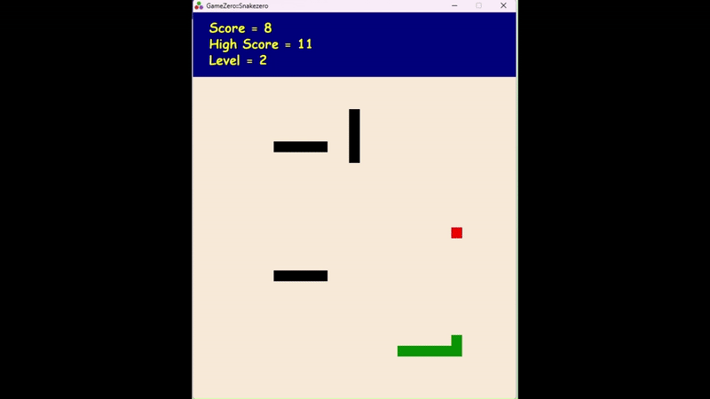

# Snake Zero

Willkommen bei **Snake Zero**, einem klassischen Snake-Spiel, das mit der leistungsstarken Julia-Programmiersprache und der GameZero-Bibliothek entwickelt wurde! Dieses Projekt kombiniert Retro-Spielspaß mit moderner Programmierung und bietet spannende Herausforderungen durch mehrere Level und einzigartige Features.



## Merkmale

- **Retro-Gameplay**: Klassisches Snake-Gameplay, bei dem du Äpfel sammelst, um Punkte zu erzielen und die Schlange wachsen zu lassen.
- **Dynamische Level**:
  - **Level 1**: Keine Hindernisse, ideal für Anfänger.
  - **Level 2**: Hinzufügung von symmetrischen Hindernissen, die die Herausforderung erhöhen.
  - **Level 3**: Komplexere Hindernisse für erfahrene Spieler.
  - **Level 4**: Symmetrische Hindernisse in größerer Zahl.
  - **Level 5**: Ein großes, zentriertes "S"-förmiges Hindernis für maximale Spannung.
- **Power-Ups**:
  - Spezial-Äpfel, die doppelte Punkte bringen und die Geschwindigkeit der Schlange kurzzeitig erhöhen oder verringern.
- **Herausforderungen durch Hindernisse**:
  - Hindernisse werden mit jedem Level komplexer und erfordern geschickte Steuerung.
- **Soundeffekte und Musik**:
  - Hintergrundmusik für ein immersives Spielerlebnis.
  - Spezielle Soundeffekte beim Sammeln von Äpfeln und bei Game-Over-Ereignissen.
- **Game-Over-Bildschirm**:
  - Ermöglicht den Neustart des Spiels per Mausklick.
- **Eingabesteuerung**:
  - Steuerung der Schlange mit den Pfeiltasten.
  - Spielstart und Neustart per Mausklick.

## Technische Details

- **Programmiersprache**: Julia
- **Spielbibliothek**: GameZero
- **Entwicklungsumgebung**: Lokale Julia-Umgebung
- **Verwendete Ressourcen**:
  - Musikdateien (Hintergrundmusik und Soundeffekte)
  - GameZero-Elemente für die einfache Erstellung von Grafiken und Benutzerinteraktionen

## Installation

1. **Voraussetzungen**:
   - Installiere Julia (Version 1.8 oder höher).
   - Installiere die GameZero-Bibliothek:  
     ```julia
     ] add GameZero
     ```

2. **Projekt klonen**:
   - Klone das Repository auf deinen Computer:
     ```bash
     git clone <repository-url>
     cd SnakeZero
     ```

3. **Projektabhängigkeiten aktivieren**:
   - Starte Julia im Projektordner:
     ```bash
     julia --project
     ```
   - Installiere die Abhängigkeiten:
     ```julia
     ] instantiate
     ```

4. **Spiel starten**:
   - Führe das Hauptspiel aus:
     ```julia
     using GameZero
     GameZero.rungame("scr/snakezero.jl")
     ```

## Spielanleitung

1. **Spielstart**:
   - Klicke auf den Startbildschirm, um das Spiel zu beginnen.
2. **Steuerung**:
   - Bewege die Schlange mit den Pfeiltasten (⬅️⬆️➡️⬇️).
3. **Ziel**:
   - Sammle die roten Äpfel, um Punkte zu erzielen.
   - Vermeide Hindernisse und den Rand des Spielfelds.
4. **Levelaufstieg**:
   - Erreiche bestimmte Punktzahlen, um neue Levels mit zusätzlichen Hindernissen freizuschalten.
5. **Game Over**:
   - Wenn die Schlange ein Hindernis, den Rand oder sich selbst trifft, endet das Spiel.
   - Klicke auf den Game-Over-Bildschirm, um neu zu starten.

